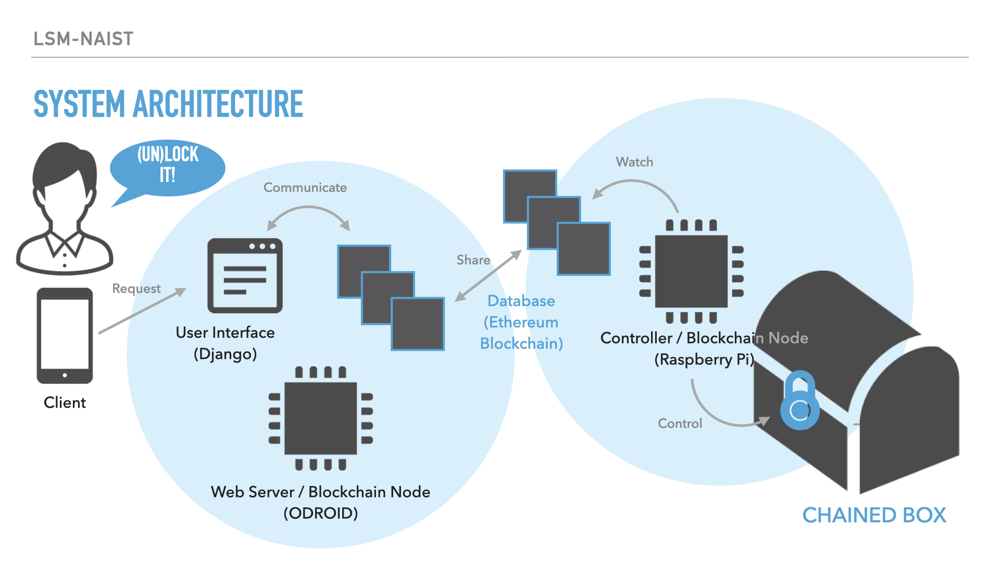

# CHAINED BOX

<!--  -->

## 製品概要
## Product Outline
### 背景(製品開発のきっかけ、課題等）
### Background

### 製品説明（具体的な製品の説明）
### Product Description
### 特長
### Advantages
#### 1. Data Secure
- Blockchains are more difficult to change maliciously. 
- Blockchains are maintained by a peer-to-peer network. The system keeps running even if one node goes down. 
#### 2. Electric Payment
- You can pay with crypto-currency.
- A bank account or cash are not needed.
#### 3. Automation
- Smart contracts (as known as the feature of Ethereum) enable the automation of contracts.

### 解決出来ること
### Solutions
### 今後の展望
### Future Work
### 【予定】注力したこと（こだわり等）
### 【Planed】Focused Points
* Make the Data Secure
    - We use the Ethereum blockchain. 
* Make it Easy to Use
    - We develop the web-based user interface.
* Make the System Simple and Small
    - We use single board computers to make the system simple and small. The features give the box portability.
* Make the Box Beautiful
    - We give the box cool looks.

## 開発
## Development
### システムの構成
### System Architecture

### 活用した技術
### Used Technologies
* Database with a Blockchain
* IoT with Single Board Computers

#### フレームワーク・ライブラリ・モジュール
#### Frameworks, Libraries, Modules
* Software
    - Web Server (WS)
        - Nginx: Web server and reverse proxy
    - Web Application (WA)
        - Django: Python-based web framework
    - Blockchain (BC)
        - Ethereum
            - Go Ethereum: Official Golang implementation of the Ethereum protocol
    - Lock Controller (LC)
        - Self-made program
            - Python: Programing language
            - Web3: Python library for interacting with Ethereum
    - Environment Setup
        - Docker: Platform of container virtualization
        - Docker-compose: Orchestration tool for Docker

#### デバイス
#### Devices
* Hardware
    - Host (WS/WA/BC)
        - ODROID N2: Single board computer with Arm 64-bit, OS (Ubuntu 20.04)
    - Host (LC/BC)
        - Raspberry Pi: Single board computer with Arm 32-bit, OS (Raspbian buster 10)
    - Lock Actuator
        - SR90: Servo motor
    - Battery (Raspberry Pi, Mini Monitor)
        - ELECOM Mobile Battery 6000mAh, 5V, 3A: Mobile Battery
        - Anker PowerCore 10000mAh, 5V, 2.4A: Mobile Battery

### 独自技術 
### Our Own Technologies
#### ハッカソンで開発した独自機能・技術
### Our Own Features Made in this Hackathon
* 独自で開発したものの内容をこちらに記載してください
* 特に力を入れた部分をファイルリンク、またはcommit_idを記載してください。

#### 製品に取り入れた研究内容（データ・ソフトウェアなど）（※アカデミック部門の場合のみ提出必須）
#### Applied Contents from our Research
* Blockchain
    - Substitute  a blockchain for a relational database
