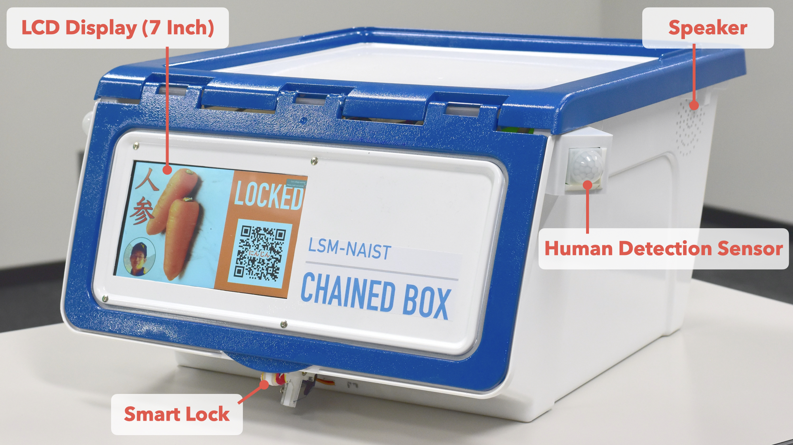
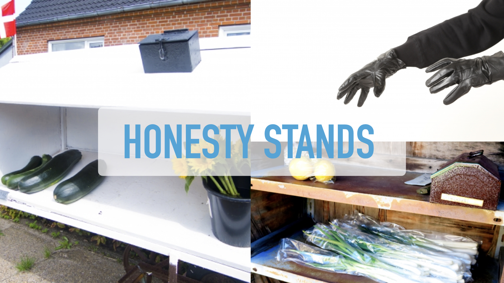
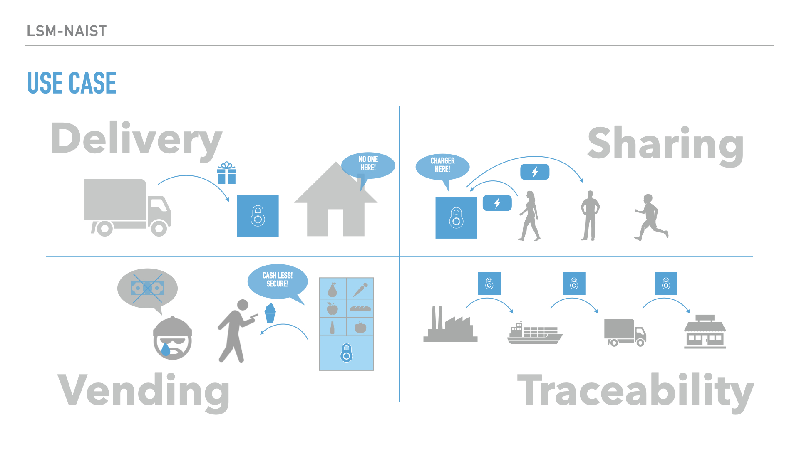
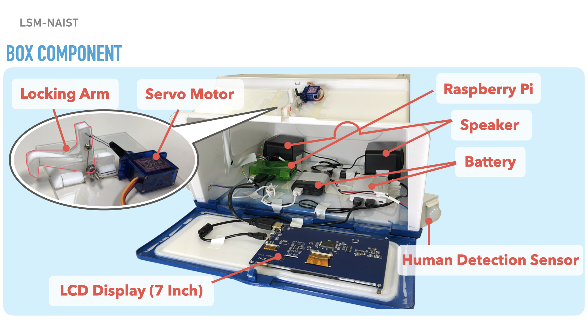

# CHAINED BOX
### 昨年の組織委員長の「グローバルに戦えるところを次の目標にしてほしい」というコメントを受けて，英語で記載します．
### Considering the comment from last year's chair "I want you to gain international competitiveness as your next goal.", we decided to write this README.md in English. 
- Wiki (Github)  
    - 
- CI (Travis)
    - Branch: master  
        -   
    - Branch: develop  
        -   

<!--  -->

## 90 Sec. Pitch Video 

## Promotion Video

## チーム名
## Team Name
### LSM-NAIST
### 私たちについて
### About Us
- We are master's students of Large-Scale Systems Management Lab., Nara Institute Science and Technology, Japan.
## 製品概要
## Product Outline

### 背景(製品開発のきっかけ、課題等） 
### Background

Honesty stands are unmanned stores. As you can guess form the word “honesty”, the buyers are expected to be “honest”. But sometimes, the merchandises or the cash from the sales are stolen by dishonest thieves. The result shouldn't be a surprise to anyone. Billy Joel sings "Honesty is a such lonely word. Everyone is so untrue". ***Protecting the merchandises and the cash with existing vending machines is one solution, but the price of them is high. Therefore, buying an existing vending machine doesn't pay off in the end. Then, we propose a simple and low-cost smart IoT box named “Chained Box” for small business.***
### 製品説明（具体的な製品の説明）
### Product Description
Chained Box is a smart IoT box controlled by a blockchain. It enables to protect the the merchandises and the sales.
Buyers can pay for the merchandise with electric payment (crypto-currency).
Sellers can receive the payment safely.
And, since the sales history is stored in the blockchain, the sellers are free from bookkeeping.
They can focus more efficiently on their main business. 

### 解決出来ること
### Solutions
#### 1. Chained Box is simple and cheap.
- Because...
    - There is no need to equip complex mechanisms to receive cash.
    - There is no need to maintain a secure central server. (And the server needs high-costs.)
    - It is designed for individuals or small business.
#### 2. Chained Box protects the merchandises and cash from dishonest thieves.
#### 3. Chained Box stores all the past transactions. You can check the sales history.

### 使用方法
### How to Use

You can use Chained Box as following steps.  
#### 1. Scan the QR code. Then access our web page. (Chrome is strongly recommended.)  
#### 2. Pay for the merchandise. Then the box is unlocked. Get your item.

### なぜブロックチェーンを使うのか
### Why Blockchain
#### 1. Fault Tolerance
- Blockchains are maintained by a peer-to-peer network. The system keeps running even if one node goes down.
#### 2. Low-Cost Electronic Payment Function
- The electronic payment function can be implemented at low cost by the blockchain. The server/client model needs a secure central server. And the server needs high-costs.

### 特長
### Advantages

#### 1. Data Security
- Blockchains are difficult to change maliciously. 
#### 2. Electric Payment
- You can pay with crypto-currency.
- A bank account or cash are not needed.
#### 3. Automation
- Smart contracts (as known as the feature of Ethereum) execute a predefined job when a predefined event happens.
- You can see all the past transactions, since the transactions are stored in blocks.  

### 注力したこと（こだわり等）
### Focused Points
#### 1. Make the Data Secure
- We used Ethereum blockchain. 
#### 2. Make it Easy to Use
- We developed the web-based user interface. And users can see the status of the box from the equipped display. 
#### 3. Make the System Simple and Small
- We used single board computers to make the system simple and small. The features gave the box portability.
#### 4. Make the Box Beautiful
- We gave the box cool looks. We changed its boring appearance by painting. 
#### 5. Make it Practical
- The lock mechanism has practical durability, adopting hard materials (metal and plastic). Plus, the mechanism is small to maximize the capacity of the box.
#### 6. Make our Perspective Global
- We made this README.md and the 90 sec pitch video in English to let the world know our product.

### 今後の展望
### Future Work
- Browsing the sales history
- Notification of out of stock to sellers/customers
- Promoting new arrivals to customers via push notification
- Monitoring open/close of the lid, automatically locking

### その他のユースケース
### Other Use Cases

#### 1. Delivery
#### 2. Sharing
#### 3. Traceability

## 開発
## Development
### システムの構成
### System Architecture

### 物理構成
### Physical Architecture

### ボックスの構成
### Box Component

### 活用した技術
### Technologies We Used
- Blockchain
- IoT with Single Board Computers
- Web Framework
- Virtualization with Containers
- Continuos Integration Tool

#### フレームワーク・ライブラリ・モジュール
#### Frameworks, Libraries, Modules
* Software
    - Web Server (WS)
        - Nginx: Web server and reverse proxy
    - Web Application (WA)
        - Django: Python-based web framework
    - Blockchain (BC)
        - Ethereum
            - Go Ethereum: Official Golang implementation of the Ethereum protocol
    - Lock Controller (LC)
        - Self-made program
            - Python: Programing language
            - Web3: Python library for interacting with Ethereum
    - Environment Setup
        - Docker: Platform of container virtualization
        - Docker-compose: Orchestration tool for Docker

#### デバイス
#### Devices
* Hardware
    - Chained Box
        - Controller (LC/BC)
            - Raspberry Pi: Single board computer with Arm 32-bit, OS (Raspbian buster 10)
        - Lock Actuator
            - SG-90: Servo motor
        - Body
            - DAISO Stacking box 600JPY+Tax: Box
        - Display
            - Longruner 7inch LCD Display 1024 * 600: Display  
        - Battery (Raspberry Pi, Mini Display)
            - ELECOM Mobile Battery 6000mAh, 5V, 3A: Mobile Battery
            - Anker PowerCore 10000mAh, 5V, 2.4A: Mobile Battery
    - Web Server (WS/WA/BC)
        - ODROID-N2: Single board computer with Arm 64-bit, OS (Ubuntu 20.04)
    - Router
        - DOCOMO Hikari Router: Wi-Fi Router

### 独自技術 
### Our Own Technologies
#### Smart Contract
- We automate payment with smart contracts (Solidity).
#### Virtualization
- We used virtualization technologies (especially docker) in all the processes. 
#### Painting
- Product-level paint with strong base painting and finish coating
#### Processing Parts of Mechanisms 
- We processed small plastic parts precisely and accurately.

### ハッカソンで開発した独自機能・技術
### Our Own Features Made in this Hackathon
#### Payment Contract
- Kentaro Fujita wrote [lock.sol (on the Blockchain)](https://github.com/jphacks/D_2002/blob/master/server/web/src/static/contracts/lock.sol).    
#### Implementation of Blockchain in Multiple Single Board Computers
- Kentaro Fujita wrote [geth (on the Raspberry Pi)](https://github.com/jphacks/D_2002/tree/master/controller/geth).  
- Kentaro Fujita wrote [geth (on the ODROID-N2)](https://github.com/jphacks/D_2002/tree/master/server/geth).  
#### Forwarding the Video Output from a Docker Container to the Host Machine
- Takeaki Matsunaga wrote the L68-72, L76-80, L85-86, and L95-96 of [watch.py (on the Paspberry Pi)](https://github.com/jphacks/D_2002/blob/master/controller/watcher/src/watch.py).  
- Takeaki Matsunaga wrote the L10-12 of [docker-compose.yml (on the Paspberry Pi)](https://github.com/jphacks/D_2002/blob/master/controller/docker-compose.yml).
#### Web-based User Interface
- Takeaki Matsunaga wrote [web (on the ODROID-N2)](https://github.com/jphacks/D_2002/tree/master/server/web).  
#### Designing the Lock Mechanism
- Seiya Tanaka wrote [README.md (hardware)](https://github.com/jphacks/D_2002/tree/master/hardware#ロック機構の開発).  

### 開発のタイムライン（履歴）
### Development Timeline (History)
- Please check [the development timeline](https://github.com/jphacks/D_2002/wiki/Development-Timeline) on the wiki.

#### 製品に取り入れた研究内容（データ・ソフトウェアなど）（※アカデミック部門の場合のみ提出必須）
#### Applied Contents from our Research
* Blockchain
    - Substitute  a blockchain for a relational database
