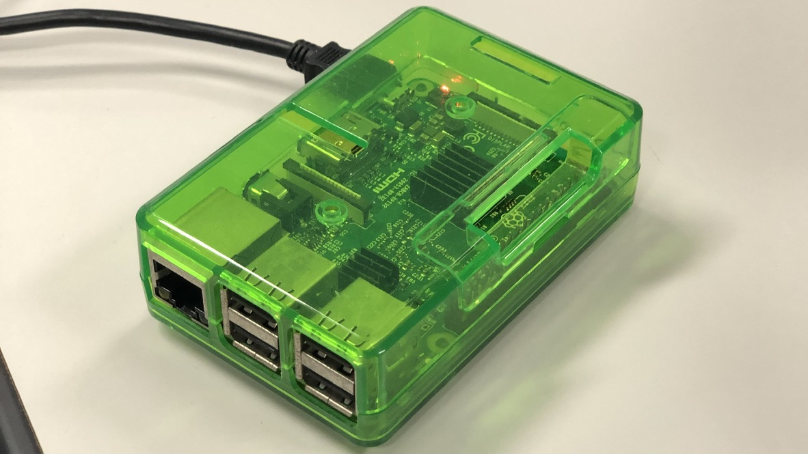

# Raspberry Pi (Lock Controller in Chained Box)

## Services
This single board computer hosts the services as follows.
- Web Server: Nginx
- Watcher: Self-made program to watch the blockchain
            - Python: Programing language
            - Web3: Python library for interacting with Ethereum
- Blockchain: Geth (Go Ethereum)