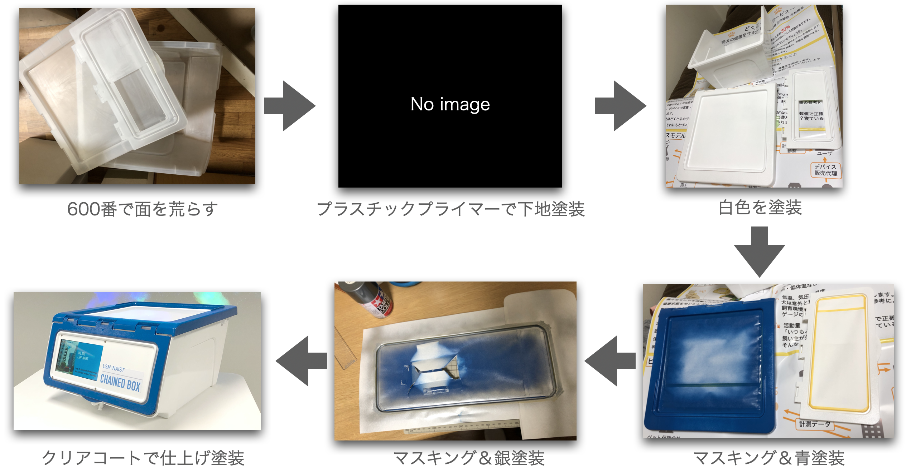

# 筐体の製作
筐体には100円ショップで購入したボックスを使用し，製品イメージに合うように塗装した．

しかしボックスの素材は，プラスチックの中でも最も塗装の乗りにくいポリプロピレンであった．そのため表面を600番のヤスリで荒らし，プラスチックプライマーを下地として塗ることで対策を行った．その後，マスキングと基本色の塗装を繰り返し，最後にクリアコートを厚く吹き付けた．こうして，実運用で酷使しても剥げない塗装を実現した．

# ロック機構の開発
ロック機構では，「小さく」「頑強で」「確実動作する」ことを目指した．  
そのため，まずは機構の構造を考案した．複雑なリンクとはせず，小さなサーボとかぎ爪をつかった機構を採用した．

そして確実に動作させるために，紙で試作を繰り返しながら最終的な寸法を決定した．

頑強な機構とするために，加工が大変な2mmプラバンを基軸として，加工のしやすい5mmプラ角柱を組み合わせて部品を製作した．さらに，バネや軸に金属部品を使用して，より丈夫なものとした．

また，部品を直接筐体に取り付けるのではなく，周辺部品を一体化したモジュールにして取り付けた．これにより将来的に，最小の改造で異なる筐体にもロック機構を取付け可能とした．

以上により，下記のことを実現した．
- ラズパイよりも小型化することができた．これにより，ロック機構を完全に筐体の裏面に収め，荷物の収容スペースを最大化した．

- 下の写真のように，分厚い２冊の本を紐でフタ部分に吊り下げて，ロック機構の耐久試験を実施した．このように強い力をフタに加えても壊れないようなロック機構を開発することができた．  

# 呼び込み機能付与
IoTボックスは前を横切る歩行者をセンサで検知して，スピーカから音声を出して商品を宣伝し，客を呼び込む．
そのためのセンサとスピーカをボックスに搭載した．
## 人感センサ
人を検知するセンサとして，焦電型赤外線センサを使用した．これは人から発せられる赤外線を検知するセンサである．このセンサ用にカバーを作成し，筐体に取り付けた．このセンサはRaspberry PiのGPIOに接続される．
### センサ数と位置の決定
歩行者はボックスの前を横切るので，左右に幅広くセンサの検知範囲を取る必要がある．そのためにセンサを左右に１つずつ，角度をつけて設置した．

### センサカバーの作成
センサを設置しても外観を損ねないように，センサ受光部以外を覆うカバーをプラスチック素材を用いて作成した．
まず厚紙を使って試作を行った．その後，プラスチック板とプラスチック棒を用いて本制作を行った．

### センサカバーの設置
簡単に取り外せるように，ファスナーテープで筐体に設置した．

## スピーカ
スピーカについても幅広い領域で音を届けられるように，筐体の左右に１つずつ設置した．
### スピーカの設置
外観を損なわないように，スピーカ本体を筐体内の蓋の裏に設置した．

### スピーカ穴の加工
筐体外にスピーカの音が届くように，筐体のスピーカ部分に微小な穴を開けた．
穴の配置としては，商用のスピーカで実際に使われている穴位置を調査し，反映した．
その穴を正確に開けるために，CADでまず型紙を制作し，それを筐体に貼り付けてドリルで穴を開けていった．片側約70個の穴があるので，合計約140個の穴を開けた．
